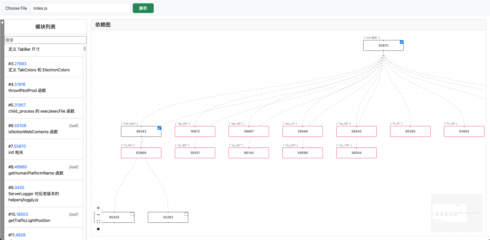

# deps-graph

依赖图分析，用于分析 webpack 打包后的模块依赖关系，尤其是用于辅助 Notion app 逆向(https://github.com/jooooock/notion)。

## Build With

- [Deno](https://deno.com/)
- [Vue.js](https://vuejs.org/)
- [Vue Flow](https://vueflow.dev/)
- [jscodeshift](https://github.com/facebook/jscodeshift)

## 注意

由于 Deno Deploy 免费账户的资源限制(CPU使用时间)，在解析模块依赖时会出现超时情况，因此推荐本地运行。
